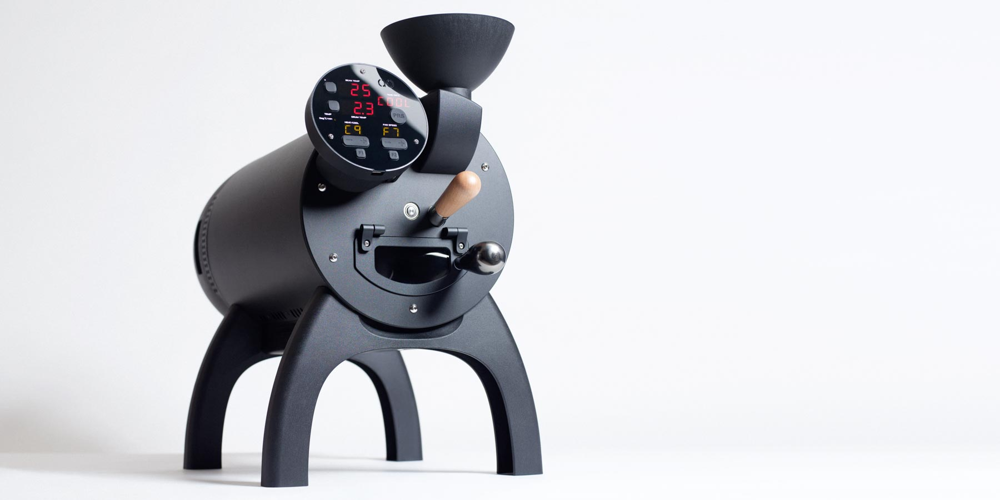

# Aillio Bullet R1 V2

# Specs and Safety

**Heating:** Induction heating

**Input Voltage:** 100V-127V & 220V-240V – 50Hz-60Hz

**Power Requirement:** 1550W

**Maximum Recommended Ambient Temperature:** 30°C

**Drum:** Multi-vane, 5.9L solid drum

**Exhaust Fan:** 78mm removable aluminum centrifugal fan for easy cleaning.

**Bean Loading:** Through funnel

**Bean Ejection:** Manual

**Bean Cooling Tray:** Detachable. Fan Cooling. Connected to underside of roaster.

**Bean Roast Temp:** Max 245°C

**Chaff Collector:** Detachable. Empty every 2-3kg of roasting.

**Roast Capacity:** Maximum 1000g, Minimum 100g (fastest roasting for 1kg to first crack is 10-12min)

**Monthly Capacity:** 100kg

**Size:** L: 59cm W 31cm: H:42cm (L:75cm including bean cooler)

**Weight:** 18KG

**Warranty:** 2 years

**Country of Origin:** Designed and engineered in Denmark. Made in Taiwan.

**Protection:** Electronics over temperature on both PCBs. Heater over temperature protection. Fan lock protection on all fans.

**Fault logging:** System status is monitored on all major components.

**Official Link:** [https://aillio.com](https://aillio.com/?page_id=23112)