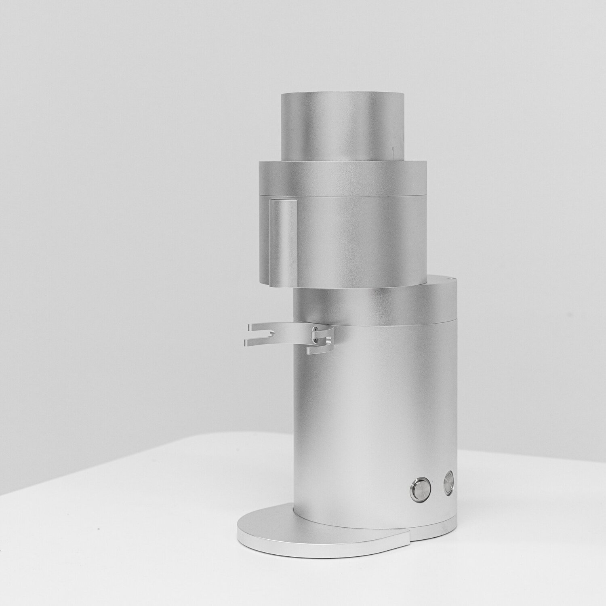

# Lagom P100

## Feature summary

* 98 mm Flat Burrs by SSP (High-Uniformity)
* High precision (critical part tolerance <0.01 mm) and permanent alignment by design
* Compact footprint
* Variable Speed (200 RPM - 1700 RPM)
* Low Retention (<0.1 g, practically zero retention) without RDT 
* Calibrate-able number scale system for grind setting reference
* Auto on/off & smart purge program
* Tool-less design for easy routine cleaning

## Technical Specifications

**Burr size** 98 mm flat burrs

**Grind setting range**

* Step-less adjustment
* French Press to Turkish Coffee
* Each line (0.1) moves 0.0075 mm (7.5 micron) vertically

**Typical dynamic grind retention**

* With RDT: <0.1 g
* Without RDT: <0.1 g

**Size (width x depth x height); weight**

* 15cm x 23cm x 39.5cm
* 5.9" x 9" x 15.5"; 14.8kg

**Grinding speed** Adjustable RPM, 200-1700rpm

**Grinding throughput** Up to 5 g/sec at espresso setting

**Construction Material** 6061-T6 CNC machined and anodised aluminium

**Bean loading Capacity** Holds up to 100 g in funnel, with ability to feed continuously for larger batch grinding

**Motor** Industrial-grade brushless DC motor (Peak 1300W)

**Voltage** 100-120V or 220-240V

**Warranty**

* 1-year limited warranty against manufacturing defects
* Lifetime support

## Official Link

[https://www.option-o.com/lagom-p100](https://www.option-o.com/lagom-p100)
