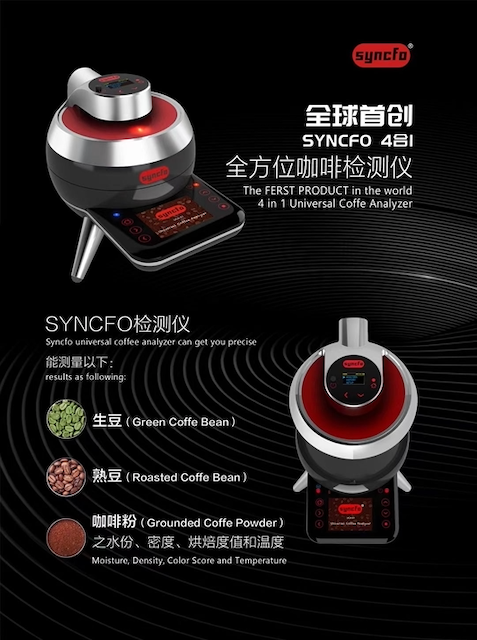

# Syncfo UCA-01

## 产品特点

1.触控屏幕，轻松操作

2.易于携带，易于存储，专属定制航空箱

3.省电模式，延长电池寿命

4.世界首台多功能咖啡分析仪

5.精确测量，与Gourmet量表使用的Agtron测量相同

## 检测范围

含水率:1％〜20％(咖啡生豆 : >8%  咖啡熟豆 : >1%  咖啡粉 : >1% )

密度:100〜1000g / L

颜色:1〜150（与SCAA / Agtron Gourmet兼容）

重量:0〜1100gr

温度:-10〜50℃

## 规格

产品:Syncfo UCA-01

显示:LED指示灯

颜色传感器:红外线IC芯片传感器

电源供应:

电源适配器:110V / 220V至5V

锂电池

尺寸:26x17x23cm（HxWxD）（带遮光罩）

重量:2.3公斤

认证:CE，FCC

## 官方站点

[https://syncfo.com](https://syncfo.com/chs/product.php#my)
