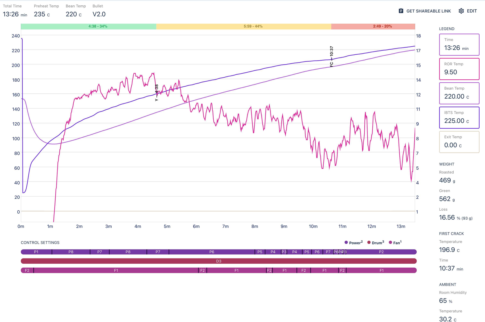

# 烘焙记录#55

## 烘焙曲线

**原始连接:** [RS#55 - Myanmar Mandheling](https://beta.roast.world/@carusyte/roasts/i07AFdu3YGkPeVnOjEasz?) (需要注册登录才能访问)

## 咖啡生豆

**来源:** [PR#20-巴比伦庄园，水洗湿抛曼特宁](https://oscoffee.github.io/origin/#/docs/procurement/2021/Mar/pr20/)

**毛重:** 619.6g

**瑕疵豆:** 57.3g

**筛选后:** 562.3g

**瑕疵率:** 9.25%

**含水率:** 11.7%

**密度:** 829 g/L

**检测日期:** 2021-7-13

## 烘焙数据

**烘焙日期:** 2021-7-14

**环境温度:** 30.2°C

**环境湿度:** 65%

**投放温度(IBTS):** 235°C

**熟豆净重:** 469.2g

**失重率:** 16.6%

**结束温度(IBTS):** 225°C

**烘焙时长:** 13:26

**烘焙度:** City (城市烘焙)

**Agtron:**

* 咖啡豆: 52.1
* 咖啡粉: 59.9
* 磨豆机刻度: 5
* 磨豆机转速: N/A
* 粉/豆差值: 7.8
* 粉/豆平均值: 56

## 相关设备

**烘焙机:** [Aillio Bullet R1 V2](https://oscoffee.github.io/roastery/#/docs/gears/Aillio%20Bullet%20R1%20V2/)

**磨豆机:** [Lagom P100](https://oscoffee.github.io/roastery/#/docs/gears/Lagom%20P100/)

**检测仪:** [Syncfo UCA-01](https://oscoffee.github.io/roastery/#/docs/gears/Syncfo%20UCA-01/)
